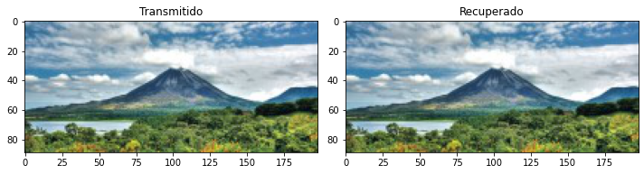
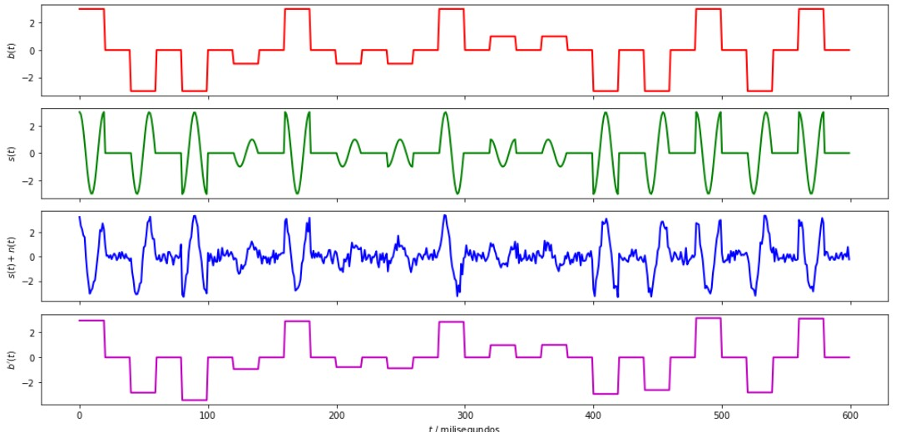
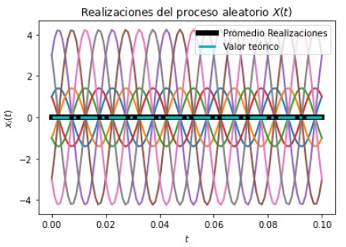
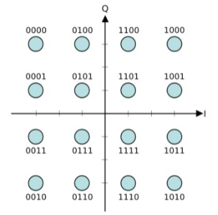
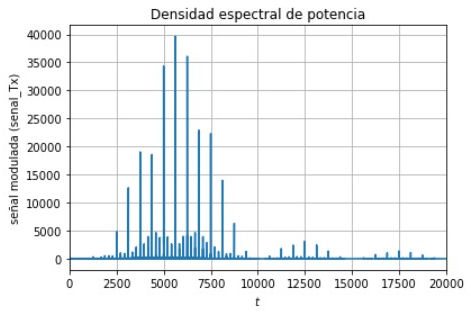

# Proyecto 4
Proyecto 4 de Modelos Probabilísticos de Señales y Sistemas

## Autor
Jose Andrey Salazar Vargas B87241

### 4.1. - Modulación 16-QAM

Como se solicitó se realizó una simulación del sistema de comunicaciones, usando una modulación 16-QAM. Para poder modificar el código de la modulación BPSK, se tuvo que tomar en cuenta de sobre manera que en este caso son dos portadoras que permite llevar sus respectivas señales separadas, y la cantidad de bits a analizar, ya que no era un bit como en la modulación BPSK o 2 bits como en la modulación QPSK, son 4 bits; no obstante se analizan los dos primeros bits para la "Portadora 1" (la cual es acopañada por coseno) y los otros dos bits para la "Portadora 2" (la cual es acompañada por seno).

Como se puede observar en la imagen se obtiene que la imagen recuperada es igual a la imagen transmitida. En los datos de la imagen se observa que se tiene 0 errores, como consecuencia de esto se obtiene que la tasa de error de bit (BER) sea cero, debido a su fórmula que es la razón entre bit fallados y bit totales; se infiere rápidamente que los bits fallados son equivalentes a los errores y el resultado de la razón es 0.

De las siguientes gráficas se tiene como primera curva "La onda cuadrada moduladora" (color rojo), como se espera la misma es una señal cuadra con cuatro posibles valores, debido a que se toman -3, -1, 1 y 3. Se elije el valor de la moduladora respecto al valor que tenga la portadora, por lo tanto, se la portadora tiene un valor de -1 así mismo lo tendrá la moduladora. Los valores se asignan teniendo en cuenta los datos propuestos en la teoría.

La segunda curva es "La señal modulada por 16-QAM" (color verde), se puede ver que es una curva muy bien definida sin ningún asomo de ruido, por lo tanro, la modulación obtenida con el modulador 16-QAM es excelente. Se observa en la tercera gráfica "La señal modulada al dejar el canal" (color azul). Se elije que la relación señal a ruido (SNR) se 10, a pesar de que es mayor la potencia de la señal, sigue siendo poca para poder eliminar el ruido; debido a esto es que se observa que la curva azul no está bien definida, sin embargo, a grandes rasgos se puede apreciar que dicha curva tiene un comportamiento similar al de la curva verde.

Por último, se tiene la cuarta curva que es "La señal demodulada" (color magenta). En la función del demodulador en la sección "Criterio de decisión por detección de energía" se decide que los bits van a tomar el valor de la apmlitud definida para las portadoras, dicho de otra forma, si para la portadora 1 se tiene la combinación bit1=1 y bit2=2 la amplitud será 3, así mismo para todos los casos. Como consecuencia de los explicado es que se obtiene que la señal demodulada sea cuadrada. A grandes rasgos se observa que el comportamiento es similar al de la curva azul. Como consecuencia principal se observa que la señal demodulada es prácticamente igual a la onda cuadrada moduladora, exceptuando algunas amplitudes por ligeras diferencias debidas al ruido, no obstante, es un excelente resultado que se aprecia aún mejor en la imagen resultante.

### 4.2. - Estacionaridad y ergodicidad

Como se observa en la gráfica "Realizaciones del proceso aleatorio", donde se tiene 16 posibles formas de onda asociadas a las 16 combinaciones de 4 bits que se muestran en la constelación. El resultado del promedio de realizaciones (línea negra) y el valor teórico (línea turquesa) presentan el mismo valor constante a lo largo de todo el rango de valores, se debe a que las realizaciones tiene un comporatamiento simétrico, esto ocasiona que la combinación de curvas respecto al eje horizontal sean identicas. Por lo tanto, en la señal modulada senal_Tx se afirma que hay ergodicidad.

### 4.3. - Densidad espectral de potencia

En este gráfico se observa que la densidad espectral de potencia tiene su componente principal, donde está el ancho de banda de mayor importancia esta en entre 5000<t<6000 con un valor de 40000, y a su alrededor se encuentran los componentes de frecuencia de la moduladora, que conforme pasa el tiempo disminuyen debido a la discontinuidades de la función moduladora.

